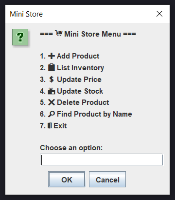

# 🛒 Mini Store JDBC

> 📄 This README is also available in [Spanish 🇪🇸](README.es.md)

A simple **inventory management system** built with **Java, JDBC, and MySQL**.  
It allows you to add, list, update, delete, and search products using a Swing-based menu interface.

---

## ✨ Features

- ➕ Add new products to the inventory
- 📋 List all products
- 💲 Update product price
- 📦 Update product stock
- ❌ Delete products
- 🔎 Find products by name
- 📊 Summary of operations performed in the session

---

## 🖼️ Preview

Here’s a preview of the application’s main menu:



---

## 📂 Project Structure

```bash
mini-store-jdbc/
├── assets/
│   └── menu-preview.png
├── src/
│   ├── main/
│   │   ├── java/
│   │   │   └── org.carturo.ministore/
│   │   │       ├── Main.java
│   │   │       ├── controller/
│   │   │       │   └── ProductController.java
│   │   │       ├── database/
│   │   │       │   └── ConnectionFactory.java
│   │   │       ├── entity/
│   │   │       │   └── Product.java
│   │   │       ├── repository/
│   │   │       │   ├── Repository.java
│   │   │       │   └── ProductRepositoryImpl.java
│   │   │       └── service/
│   │   │           ├── InventoryService.java
│   │   │           └── InventoryServiceImpl.java
│   │   └── resources/
│   │       ├── db.properties.example   # Database configuration template
│   │       └── schema.sql              # Database schema
├── .gitignore
├── LICENSE
├── pom.xml
├── README.md
└── README.es.md
```

---

## ⚙️ Requirements

- JDK 21+ (tested with JDK 24)
- Maven 3
- MySQL 8

---

## 🗄️ Database Setup

1. Create the database and table:

```sql
-- Create a database
CREATE DATABASE IF NOT EXISTS mini_store_db;
USE mini_store_db;

-- Create table
CREATE TABLE IF NOT EXISTS products (
  id INT AUTO_INCREMENT PRIMARY KEY,
  name VARCHAR(150) NOT NULL UNIQUE,
  price DECIMAL(10,2) NOT NULL,
  stock INT NOT NULL
);
```

2. Optionally, you can import the provided `schema.sql`.

---

## 🔑 Configuration

The database connection is managed via `db.properties` file in `src/main/resources`.

Example (`db.properties.example`):

```bash
driver=com.mysql.cj.jdbc.Driver
url=jdbc:mysql://localhost:3306/mini_store_db
user=your_user_here
password=your_password_here
```

Copy this file to `db.properties` and replace `your_user_here` and `your_password_here` with your actual MySQL credentials.

---

## ▶️ Run the Application

1. Build the project with Maven:

```bash
mvn clean package
```

2. Run the application using the generated `.jar` file inside the `target/` directory:

```bash
java -cp target/mini-store-jdbc-1.0-SNAPSHOT.jar org.carturo.ministore.Main
```

The application will start with a Swing-based menu interface.

---

## 📜 License

This project is licensed under the [MIT License](LICENSE).